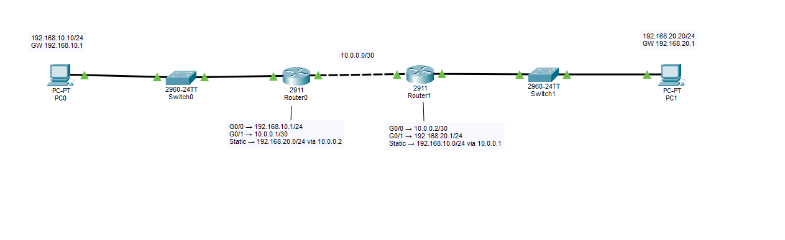

<p align="center">
  
</p>

# CCNA Network Labs

Cisco Packet Tracer와 Cisco IOS CLI를 활용하여  
**CCNA 네트워크 개념을 직접 구성하고 검증한 실습 포트폴리오**입니다.

단순히 명령어를 암기하는 것보다,

**구성(Configuration) → 검증(Verification) → 장애 확인(Troubleshooting) → 복구**

과정을 반복하면서 네트워크가 실제로 어떻게 동작하는지 이해하는 것을 목표로 하고 있습니다.

---

## 실습 환경

- Cisco Packet Tracer 9.0.1
- Cisco IOS CLI
- CCNA 200-301
- Windows

---

## 현재까지 학습한 기술

### Switching / Layer 2

- Ethernet Switching
- MAC Address Table
- ARP
- VLAN
- Broadcast Domain
- Access Port
- Trunk Port
- IEEE 802.1Q

### Routing / Layer 3

- IPv4 Addressing
- Subnet Mask 기초
- Default Gateway
- Inter-VLAN Routing
- Router-on-a-Stick
- Connected Route
- Local Route
- Static Route
- Next Hop
- Routing Table

### Verification / Troubleshooting

- `ping`
- `tracert`
- `arp -a`
- `show mac address-table`
- `show vlan brief`
- `show interfaces trunk`
- `show ip interface brief`
- `show ip route`
- `show cdp neighbors`

---

# 실습 목록

| Lab | 주제 | 주요 내용 | 상태 |
|---|---|---|---|
| Lab 01 | Basic Switching | Ethernet, ARP, MAC Address Table, ICMP | ✅ 완료 |
| Lab 02 | VLAN Segmentation | VLAN 10/20, Access Port, Broadcast Domain 분리 | ✅ 완료 |
| [Lab 03](./labs/03-router-on-a-stick/README.md) | Router-on-a-Stick | 802.1Q Trunk, Subinterface, Inter-VLAN Routing | ✅ 완료 |
| [Lab 04](./labs/04-static-routing/README.md) | Static Routing | Static Route, Next Hop, /30, CDP, Routing Troubleshooting | ✅ 완료 |
| Lab 05 | IPv4 Subnetting | CIDR, Network/Broadcast/Host Range | ⏳ 예정 |
| Lab 06 | STP / RSTP | Loop 방지, Root Bridge, Port Role | ⏳ 예정 |
| Lab 07 | EtherChannel | LACP, Link Aggregation | ⏳ 예정 |
| Lab 08 | OSPF | Dynamic Routing, Neighbor, Route Learning | ⏳ 예정 |
| Lab 09 | DHCP | DHCP Server, Address Allocation, Relay | ⏳ 예정 |
| Lab 10 | NAT / PAT | Private/Public IP, Address Translation | ⏳ 예정 |
| Lab 11 | ACL | Standard / Extended ACL, Traffic Filtering | ⏳ 예정 |
| Lab 12 | IPv6 | IPv6 Addressing 및 Routing | ⏳ 예정 |
| Final Lab | 종합 네트워크 구축 | VLAN, Routing, DHCP, NAT, ACL, Troubleshooting | ⏳ 예정 |

---

# 대표 실습

## Lab 03 - Router-on-a-Stick

서로 다른 VLAN에 위치한 PC 간 통신을 위해  
Router-on-a-Stick 방식의 Inter-VLAN Routing을 구성했습니다.

주요 구성:

```text
VLAN 10
   │
   │ Access Port
   ▼
Switch
   │
   │ 802.1Q Trunk
   ▼
Router

G0/0.10 → VLAN 10
G0/0.20 → VLAN 20
```

사용 기술:

- VLAN 10 / VLAN 20
- Access Port
- IEEE 802.1Q
- Trunk Port
- Router Subinterface
- Default Gateway
- Inter-VLAN Routing
- Routing Table

➡️ [Lab 03 상세 보기](./labs/03-router-on-a-stick/README.md)

➡️ [Packet Tracer 파일](./labs/03-router-on-a-stick/03-router-on-a-stick.pkt)

---

## Lab 04 - Static Routing

두 개의 서로 다른 LAN과 두 대의 Router를 구성하고  
Static Route를 이용하여 Remote Network 간 통신을 구현했습니다.

```text
PC0
192.168.10.10/24
        │
     Switch0
        │
Router0
192.168.10.1
10.0.0.1/30
        │
        │ 10.0.0.0/30
        │
Router1
10.0.0.2/30
192.168.20.1
        │
     Switch1
        │
PC1
192.168.20.20/24
```

Router0:

```cisco
ip route 192.168.20.0 255.255.255.0 10.0.0.2
```

Router1:

```cisco
ip route 192.168.10.0 255.255.255.0 10.0.0.1
```

사용 기술:

- IPv4 Addressing
- `/30` Point-to-Point Network
- Static Routing
- Next Hop
- Routing Table
- ICMP
- Traceroute
- CDP
- Interface Troubleshooting

➡️ [Lab 04 상세 보기](./labs/04-static-routing/README.md)

➡️ [Packet Tracer 파일](./labs/04-static-routing/04-static-routing.pkt)

---

# Troubleshooting 경험

실습에서는 정상 구성만 만드는 것이 아니라  
일부 통신 실패 상황의 원인을 직접 확인하고 해결했습니다.

## Router 간 Ping 실패

Router0에서 Router1로 Ping 테스트를 수행했지만 통신에 실패했습니다.

```text
Success rate is 0 percent (0/5)
```

먼저 다음 명령어로 Interface 상태를 확인했습니다.

```cisco
show ip interface brief
```

관련 Interface가 모두 `up/up` 상태였기 때문에  
단순한 Shutdown 또는 물리적인 Link Down 문제는 아니라고 판단했습니다.

이후:

```cisco
show cdp neighbors
```

명령어를 이용하여 실제 Router 간 연결 Interface를 확인했습니다.

확인 결과 Router1의 IP Address가 실제 케이블 연결 구조와 반대로 설정되어 있었습니다.

잘못된 구성:

```text
Router1 G0/0 → 192.168.20.1/24
Router1 G0/1 → 10.0.0.2/30
```

실제 연결 구조에 맞게 다음과 같이 수정했습니다.

```text
Router1 G0/0 → 10.0.0.2/30
Router1 G0/1 → 192.168.20.1/24
```

수정 후 Router 간 ICMP 통신이 정상적으로 성공했습니다.

이를 통해 단순히 Interface가 `up/up`이라는 사실만으로  
의도한 장비와 올바르게 연결되어 있다고 판단할 수 없다는 점을 확인했습니다.

---

## Overlapping Network 오류

IP Address를 다른 Interface로 이동하는 과정에서 다음 오류도 확인했습니다.

```text
% 10.0.0.0 overlaps with GigabitEthernet0/1
```

기존 Interface에 같은 Network가 설정된 상태였기 때문에 발생한 문제였습니다.

기존 IP Address를 먼저 제거한 후:

```cisco
no ip address
```

올바른 Interface에 다시 IP Address를 설정하여 해결했습니다.

---

# 주요 Cisco IOS 명령어

## Switch

```cisco
show mac address-table
show interfaces status
show vlan brief
show interfaces trunk
show running-config
```

## Router

```cisco
show ip interface brief
show ip route
show cdp neighbors
show running-config
```

## 설정

```cisco
enable
configure terminal
interface <interface>
ip address <IP> <Subnet Mask>
no shutdown
no ip address
no ip domain lookup
```

## 통신 확인

```text
ping <IP Address>
tracert <IP Address>
arp -a
```

---

# 학습 진행 상황

## Day 1

- [x] Basic Ethernet Connection
- [x] ARP
- [x] MAC Address Table
- [x] ICMP Ping
- [x] VLAN
- [x] Broadcast Domain
- [x] Access Port
- [x] IEEE 802.1Q
- [x] Trunk Port
- [x] Default Gateway
- [x] Router Subinterface
- [x] Inter-VLAN Routing
- [x] Router-on-a-Stick
- [x] Connected Route
- [x] Local Route

## Day 2

- [x] Router-to-Router Network
- [x] `/30` Network
- [x] Static Routing
- [x] Next Hop
- [x] Routing Table 확인
- [x] CDP
- [x] `tracert`
- [x] Interface Troubleshooting
- [x] Routing Troubleshooting

## 다음 학습

- [ ] IPv4 Subnetting
- [ ] STP / RSTP
- [ ] EtherChannel
- [ ] OSPF
- [ ] DHCP
- [ ] NAT / PAT
- [ ] ACL
- [ ] Port Security
- [ ] IPv6
- [ ] 종합 Network Troubleshooting

---

# Repository 구조

```text
ccna-network-labs/
│
├── README.md
│
└── labs/
    │
    ├── 03-router-on-a-stick/
    │   ├── README.md
    │   ├── topology.png
    │   └── 03-router-on-a-stick.pkt
    │
    └── 04-static-routing/
        ├── README.md
        ├── topology.png
        └── 04-static-routing.pkt
```

Lab을 진행할 때마다 개별 폴더에 다음 자료를 기록합니다.

```text
README.md   → 실습 과정, 설정, 검증, Troubleshooting 기록
topology.png → 최종 Network Topology
*.pkt       → Cisco Packet Tracer 실습 파일
```

---

# 목표

CCNA 학습 과정에서 Cisco Packet Tracer를 이용해 직접 Network를 구성하고,

**Configuration → Verification → Troubleshooting**

과정을 반복하여 Network 동작 원리를 이해하는 것을 목표로 합니다.

최종적으로는 VLAN, Routing, OSPF, DHCP, NAT, ACL 등의 기술을 통합한  
종합 네트워크 환경을 직접 구축하고 Troubleshooting할 수 있는 수준까지 학습할 예정입니다.
