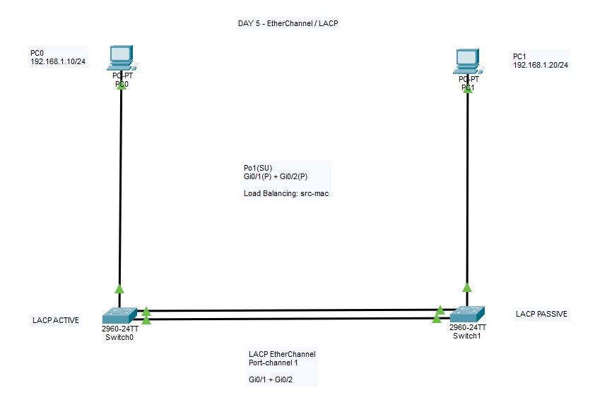
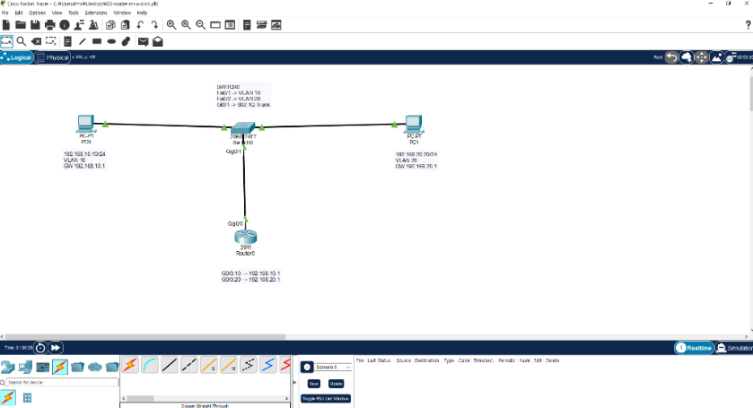

<p align="center">
  
</p>

<p align="center">
  <b>Lab 07 — EtherChannel · LACP · Link Aggregation · Failover</b>
</p>

<br>

<p align="center">
  
</p>

<p align="center">
  <b>Lab 06 — STP / RSTP · Redundancy · Failover</b>
</p>

<br>

<p align="center">
  
</p>

<p align="center">
  <b>Lab 05 — IPv4 Subnetting · Proxy ARP Troubleshooting</b>
</p>

<br>

<p align="center">
  
</p>

<p align="center">
  <b>Lab 04 — Static Routing · Routing Troubleshooting</b>
</p>

<br>

<p align="center">
  
</p>

<p align="center">
  <b>Lab 03 — VLAN · Router-on-a-Stick</b>
</p>

<br>

# CCNA Network Labs

Cisco Packet Tracer와 Cisco IOS CLI를 활용하여  
**CCNA 네트워크 개념을 직접 구성하고 검증한 실습 포트폴리오**입니다.

단순히 명령어를 암기하는 방식보다,

**Configuration → Verification → Troubleshooting → Recovery**

과정을 반복하면서 네트워크가 실제로 어떻게 동작하는지 이해하는 것을 목표로 하고 있습니다.

각 Lab에는 가능한 경우 다음 자료를 함께 기록합니다.

- Packet Tracer 실습 파일
- Network Topology 이미지
- Cisco IOS 설정 명령어
- 통신 검증 결과
- 장애 발생 원인
- Troubleshooting 과정
- 실습을 통해 배운 내용

---

# Lab Progress

| Lab | 주제 | 주요 내용 | 상태 |
|---|---|---|---|
| Lab 01 | Basic Switching | Ethernet, ARP, MAC Address Table, ICMP | ✅ 완료 |
| Lab 02 | VLAN Segmentation | VLAN 10/20, Access Port, Broadcast Domain | ✅ 완료 |
| [Lab 03](./labs/03-router-on-a-stick/README.md) | Router-on-a-Stick | 802.1Q Trunk, Subinterface, Inter-VLAN Routing | ✅ 완료 |
| [Lab 04](./labs/04-static-routing/README.md) | Static Routing | Static Route, Next Hop, /30, CDP, Routing Troubleshooting | ✅ 완료 |
| [Lab 05](./labs/05-ipv4-subnetting/README.md) | IPv4 Subnetting | CIDR, /26 Subnetting, Proxy ARP, Subnet Troubleshooting | ✅ 완료 |
| [Lab 06](./labs/06-stp-rstp/README.md) | STP / RSTP | Root Bridge, Port Role, Redundancy, Failover, Rapid PVST+ | ✅ 완료 |
| [Lab 07](./labs/07-etherchannel-lacp/README.md) | EtherChannel / LACP | Port-channel, LACP, Link Aggregation, Member Failure, Load Balancing | ✅ 완료 |
| Lab 08 | OSPF | Dynamic Routing, Neighbor, Route Learning | ⏳ 예정 |
| Lab 09 | DHCP | DHCP Server, Address Allocation, DHCP Relay | ⏳ 예정 |
| Lab 10 | NAT / PAT | Private/Public IP, Address Translation | ⏳ 예정 |
| Lab 11 | ACL | Standard / Extended ACL, Traffic Filtering | ⏳ 예정 |
| Lab 12 | IPv6 | IPv6 Addressing 및 Routing | ⏳ 예정 |
| Final Lab | 종합 네트워크 구축 | VLAN, Routing, DHCP, NAT, ACL, Troubleshooting | ⏳ 예정 |

---

# 실습 환경

- Cisco Packet Tracer 9.0.1
- Cisco IOS CLI
- CCNA 200-301
- Windows
- GitHub

---

# 현재까지 학습한 기술

## Switching / Layer 2

- Ethernet Switching
- MAC Address
- MAC Address Table
- ARP
- ICMP
- VLAN
- Broadcast Domain
- Access Port
- Trunk Port
- IEEE 802.1Q
- STP
- RSTP
- Rapid PVST+
- Layer 2 Loop
- Broadcast Storm
- Root Bridge
- Bridge ID
- Bridge Priority
- Root Port
- Designated Port
- Alternate Port
- STP Path Cost
- Layer 2 Redundancy
- Link Failover
- EtherChannel
- LACP
- Link Aggregation
- Port-channel
- LACP Active / Passive
- EtherChannel Member Port
- EtherChannel Load Balancing
- Source MAC Hash
- EtherChannel Failover

---

## Routing / Layer 3

- IPv4 Addressing
- CIDR Prefix
- Subnet Mask
- IPv4 Subnetting
- Network Address
- Host Range
- Broadcast Address
- Default Gateway
- Connected Route
- Local Route
- Static Route
- Next Hop
- Routing Table
- Inter-VLAN Routing
- Router-on-a-Stick
- Router Subinterface
- `/30` Point-to-Point Network
- Proxy ARP

---

## Verification / Troubleshooting

- `ping`
- `tracert`
- `arp -a`
- `arp -d`
- `show mac address-table`
- `show interfaces status`
- `show vlan brief`
- `show interfaces trunk`
- `show ip interface brief`
- `show ip interface`
- `show ip route`
- `show cdp neighbors`
- `show spanning-tree vlan 1`
- `show spanning-tree summary`
- `show etherchannel summary`
- `show etherchannel load-balance`
- `show running-config`
- `show running-config | include channel-group`
- Interface Mapping 확인
- Routing Table 분석
- Subnet Mask 오류 분석
- Proxy ARP 동작 확인
- Overlapping Network 오류 해결
- STP Port Role 분석
- Root Path Cost 분석
- Link Failure / Failover 검증
- EtherChannel Member 상태 분석
- LACP Mode 확인
- EtherChannel 설정 불일치 분석
- Packet Tracer 시뮬레이션 동작 차이 확인

---

# 대표 실습

# Lab 03 - Router-on-a-Stick

<p align="center">
  
</p>

서로 다른 VLAN에 위치한 PC 간 통신을 위해  
**Router-on-a-Stick 방식의 Inter-VLAN Routing**을 구성했습니다.

```text
PC0
VLAN 10
192.168.10.10/24
      │
      │ Access Port
      ▼
    Switch
      │
      │ 802.1Q Trunk
      ▼
    Router
 G0/0.10
 G0/0.20
      │
      ▼
    Switch
      │
      │ Access Port
      ▼
PC1
VLAN 20
192.168.20.20/24
```

Router Subinterface:

```cisco
interface gigabitethernet 0/0.10
 encapsulation dot1Q 10
 ip address 192.168.10.1 255.255.255.0

interface gigabitethernet 0/0.20
 encapsulation dot1Q 20
 ip address 192.168.20.1 255.255.255.0
```

### 주요 학습 내용

- VLAN 10 / VLAN 20
- Access Port
- Trunk Port
- IEEE 802.1Q
- Router Subinterface
- Default Gateway
- Inter-VLAN Routing
- Connected Route
- Local Route
- ARP / ICMP

➡️ [Lab 03 상세 README](./labs/03-router-on-a-stick/README.md)

➡️ [Packet Tracer 파일](./labs/03-router-on-a-stick/03-router-on-a-stick.pkt)

---

# Lab 04 - Static Routing

<p align="center">
  
</p>

서로 다른 두 LAN을 두 대의 Router로 연결하고  
**Static Route를 이용하여 Remote Network 간 통신**을 구현했습니다.

```text
PC0
192.168.10.10/24
        │
     Switch0
        │
Router0
G0/0 192.168.10.1/24
G0/1 10.0.0.1/30
        │
        │
   10.0.0.0/30
        │
        │
Router1
G0/0 10.0.0.2/30
G0/1 192.168.20.1/24
        │
     Switch1
        │
PC1
192.168.20.20/24
```

Router0:

```cisco
ip route 192.168.20.0 255.255.255.0 10.0.0.2
```

Router1:

```cisco
ip route 192.168.10.0 255.255.255.0 10.0.0.1
```

Routing Table:

```text
C = Connected
L = Local
S = Static
```

### 주요 학습 내용

- Router-to-Router Network
- `/30` Point-to-Point Network
- Static Routing
- Next Hop
- Connected Route
- Local Route
- Static Route
- Routing Table
- Administrative Distance
- ICMP
- Traceroute
- CDP
- Interface Troubleshooting

➡️ [Lab 04 상세 README](./labs/04-static-routing/README.md)

➡️ [Packet Tracer 파일](./labs/04-static-routing/04-static-routing.pkt)

---

# Lab 05 - IPv4 Subnetting

<p align="center">
  
</p>

하나의:

```text
192.168.10.0/24
```

Network를 `/26`으로 Subnetting하여 서로 다른 두 LAN을 만들고  
Router를 이용하여 Subnet 간 통신을 구성했습니다.

Subnet 1:

```text
192.168.10.0/26

Network   : 192.168.10.0
Host      : 192.168.10.1 ~ 192.168.10.62
Broadcast : 192.168.10.63
```

Subnet 2:

```text
192.168.10.64/26

Network   : 192.168.10.64
Host      : 192.168.10.65 ~ 192.168.10.126
Broadcast : 192.168.10.127
```

구성:

```text
PC0
192.168.10.10/26
GW 192.168.10.1
        │
     Switch0
        │
Router0 G0/0
192.168.10.1/26
        │
     Router0
        │
Router0 G0/1
192.168.10.65/26
        │
     Switch1
        │
PC1
192.168.10.70/26
GW 192.168.10.65
```

Router는 두 Network에 직접 연결되어 있기 때문에  
별도의 Static Route 없이 Connected Route를 이용해 통신할 수 있습니다.

```text
C 192.168.10.0/26
C 192.168.10.64/26
```

### 주요 학습 내용

- CIDR
- Subnet Mask
- Block Size
- Network Address
- First Host
- Last Host
- Broadcast Address
- `/24` → `/26` Subnetting
- Connected Routing
- Default Gateway
- Proxy ARP
- Subnet Mask Troubleshooting

➡️ [Lab 05 상세 README](./labs/05-ipv4-subnetting/README.md)

➡️ [Packet Tracer 파일](./labs/05-ipv4-subnetting/05-ipv4-subnetting.pkt)

---

# Lab 06 - STP / RSTP

<p align="center">
  
</p>

Switch 3대를 삼각형 형태로 연결하여  
**Layer 2 Redundancy와 STP / RSTP 동작을 직접 확인**했습니다.

```text
                 Switch0
                /       \
               /         \
          Switch1 ----- Switch2
             |             |
            PC0           PC1
```

중복 경로를 모두 Forwarding 상태로 두면 Layer 2 Loop가 발생할 수 있기 때문에  
STP가 일부 경로를 논리적으로 차단하는 것을 확인했습니다.

초기 Root Bridge:

```text
Switch0
Priority = 32768
```

Switch1:

```text
Gi0/1 → Root FWD
Gi0/2 → Altn BLK
```

---

## STP Link Failure 테스트

기존 Root Port Link를 제거한 후:

```text
Gi0/2
Altn BLK
```

였던 Port가:

```text
Gi0/2
Root FWD
```

로 변경되는 것을 확인했습니다.

기존 Root Path Cost:

```text
4
```

대체 경로:

```text
4 + 4 = 8
```

---

## Root Bridge 직접 지정

Switch2의 Priority를 낮춰 Root Bridge를 변경했습니다.

```cisco
spanning-tree vlan 1 priority 24576
```

확인:

```text
This bridge is the root
```

---

## Rapid PVST+

```cisco
spanning-tree mode rapid-pvst
```

확인:

```text
Spanning tree enabled protocol rstp
```

---

## RSTP Failover

Switch0에서 Switch2 방향 Interface를 비활성화했습니다.

```cisco
interface gigabitethernet 0/2
 shutdown
```

기존:

```text
Switch0 → Switch2
Cost 4
```

장애 후:

```text
Switch0 → Switch1 → Switch2
Cost 8
```

대체 경로를 통해 PC0 ↔ PC1 Ping 성공을 확인했습니다.

### 주요 학습 내용

- Layer 2 Loop
- Broadcast Storm
- STP / RSTP
- Rapid PVST+
- Root Bridge
- Bridge ID / Priority
- Root Port
- Designated Port
- Alternate Port
- Path Cost
- Layer 2 Redundancy
- Failover
- Topology Recalculation

➡️ [Lab 06 상세 README](./labs/06-stp-rstp/README.md)

➡️ [Packet Tracer 파일](./labs/06-stp-rstp/06-stp-rstp.pkt)

---

# Lab 07 - EtherChannel / LACP

<p align="center">
  
</p>

Switch 두 대 사이에 두 개의 GigabitEthernet Link를 구성하고  
**LACP EtherChannel을 이용해 여러 물리 Link를 하나의 논리 Port-channel로 묶었습니다.**

```text
PC0                                      PC1
 |                                        |
Switch0 =============================== Switch1
       Gi0/1                    Gi0/1
       Gi0/2                    Gi0/2

            LACP EtherChannel
               Port-channel1
```

EtherChannel 설정 전에는 STP가 두 Link를 개별 경로로 인식하여:

```text
Gi0/1 Root FWD
Gi0/2 Altn BLK
```

상태가 되는 것을 확인했습니다.

---

## LACP EtherChannel 구성

Switch0:

```cisco
interface range gigabitethernet 0/1 - 2
 channel-group 1 mode active
```

Switch1:

```cisco
interface range gigabitethernet 0/1 - 2
 channel-group 1 mode passive
```

정상 상태:

```text
Po1(SU)   LACP   Gig0/1(P) Gig0/2(P)
```

의미:

```text
Po1 = Port-channel1
S   = Layer 2
U   = In Use
P   = 정상적으로 Port-channel에 Bundle된 Member
```

---

## EtherChannel과 STP

EtherChannel 적용 전:

```text
Gi0/1
Gi0/2

→ STP가 별개의 Link로 처리
```

EtherChannel 적용 후:

```text
Gi0/1 ┐
      ├── Po1
Gi0/2 ┘

→ STP가 하나의 논리 Link로 처리
```

실제 STP 출력:

```text
Po1 Root FWD
```

을 확인했습니다.

---

## STP Cost 변화

물리 GigabitEthernet Link 하나를 사용할 때:

```text
Cost = 4
```

두 Member가 정상적으로 EtherChannel에 Bundle된 Packet Tracer 환경에서는:

```text
Po1 Cost = 3
```

을 확인했습니다.

---

## Member Link 장애 테스트

Switch0의 Gi0/1을 비활성화했습니다.

```cisco
interface gigabitethernet 0/1
 shutdown
```

EtherChannel 상태:

```text
Po1(SU)   LACP   Gig0/1(D) Gig0/2(P)
```

즉:

```text
Gi0/1 = Down
Gi0/2 = 정상
Po1   = 정상 유지
```

Member Link 하나가 Down 상태가 되어도
나머지 Member를 통해 PC0 ↔ PC1 통신이 유지되는 것을 확인했습니다.

Member가 하나만 남은 상태에서는:

```text
Po1 Cost 3 → 4
```

로 변경되는 것도 확인했습니다.

---

## Member 복구

```cisco
interface gigabitethernet 0/1
 no shutdown
```

복구 후:

```text
Po1(SU)
Gi0/1(P)
Gi0/2(P)
```

상태로 돌아왔습니다.

---

## LACP Active / Passive

LACP Mode:

```text
active
passive
```

정상적인 조합:

```text
active + active
active + passive
```

정상적으로 협상되지 않는 조합:

```text
passive + passive
```

입니다.

Packet Tracer에서는 양쪽을 Passive로 설정한 뒤에도
기존 `Po1(SU)` 상태가 유지되는 시뮬레이션 동작 차이를 확인했습니다.

Running Configuration을 통해 양쪽 모두:

```text
channel-group 1 mode passive
```

상태인 것을 검증했으며,
실제 개념과 시뮬레이터 동작을 구분하여 기록했습니다.

---

## EtherChannel 설정 불일치

Switch1의 Gi0/2에서:

```cisco
no channel-group 1
```

을 적용하여 의도적으로 양쪽 EtherChannel 설정을 다르게 만들었습니다.

이 상태에서도 살아 있는 경로가 존재해 Ping이 성공할 수 있었습니다.

따라서:

```text
Ping 성공
≠
EtherChannel 전체 구성 정상
```

이라는 점을 확인했습니다.

EtherChannel 상태는 반드시:

```cisco
show etherchannel summary
```

를 통해 Member Port의 상태를 검증해야 합니다.

---

## Load Balancing

```cisco
show etherchannel load-balance
```

결과:

```text
EtherChannel Load-Balancing Operational State (src-mac)

Non-IP: Source MAC address
IPv4:   Source MAC address
IPv6:   Source MAC address
```

이번 Switch에서는:

```text
src-mac
```

기준의 Load Balancing이 사용되고 있음을 확인했습니다.

EtherChannel은 하나의 단일 Flow를 단순히 두 Link에 반씩 나누는 방식이 아니라
Hash를 이용해 Traffic Flow를 Member Link에 분산합니다.

### 주요 학습 내용

- EtherChannel
- LACP
- Link Aggregation
- Port-channel
- LACP Active / Passive
- Interface Range
- Channel-group
- Po1(SU)
- Member Port `(P)`
- Member Down `(D)`
- STP와 EtherChannel의 관계
- Member Link Failover
- STP Cost 변화
- EtherChannel 설정 불일치
- Load Balancing
- Source MAC Hash
- Verification / Troubleshooting

➡️ [Lab 07 상세 README](./labs/07-etherchannel-lacp/README.md)

➡️ [Packet Tracer 파일](./labs/07-etherchannel-lacp/07-etherchannel-lacp.pkt)

---

# Troubleshooting 경험

정상적인 Network를 구성하는 것뿐만 아니라  
실습 중 발생하거나 의도적으로 만든 장애 상황의 원인을 직접 확인하고 복구했습니다.

---

## 1. Router 간 Ping 실패

Static Routing Lab에서 Router0 → Router1 Ping 테스트가 실패했습니다.

```text
Success rate is 0 percent (0/5)
```

먼저:

```cisco
show ip interface brief
```

를 확인했지만 Interface는 모두:

```text
up / up
```

상태였습니다.

이후:

```cisco
show cdp neighbors
```

를 통해 실제 Router 간 Interface 연결을 확인했습니다.

Router1의 IP Address가 실제 케이블 연결 구조와 반대로 설정되어 있던 것을 발견했습니다.

### 배운 점

```text
up/up
```

은 Interface와 Line Protocol이 동작한다는 의미일 뿐,
의도한 Network와 올바른 상대 장비에 연결됐다는 의미는 아닙니다.

---

## 2. Overlapping Network 오류

Interface IP 변경 과정에서:

```text
% 10.0.0.0 overlaps with GigabitEthernet0/1
```

오류가 발생했습니다.

기존 Interface의 IP를:

```cisco
no ip address
```

로 제거한 후 올바른 Interface에 다시 설정하여 해결했습니다.

---

## 3. 잘못된 Subnet Mask와 Proxy ARP

PC0의 정상 설정:

```text
192.168.10.10/26
```

을:

```text
192.168.10.10/24
```

로 변경했습니다.

예상과 다르게 Ping이 성공했고:

```cisco
show ip interface gigabitethernet 0/0
```

에서:

```text
Proxy ARP is enabled
```

상태임을 확인했습니다.

Proxy ARP를 비활성화하고 ARP Cache를 제거하자
잘못된 Subnet Mask 상태에서는 Ping이 실패했습니다.

### 배운 점

```text
Ping 성공
≠
Network 설정 전체 정상
```

Proxy ARP처럼 잘못된 설정을 겉으로 가리는 기능이 존재할 수 있습니다.

---

## 4. STP Link Failure

STP가 중복 경로를:

```text
Altn BLK
```

상태로 유지하는 것을 확인했습니다.

기존 Root Port Link 장애 후:

```text
Altn BLK
→ Root FWD
```

로 변경되었습니다.

Rapid PVST+ 환경에서도 Interface Shutdown을 통해
대체 경로가 활성화되는 것을 확인했습니다.

### 배운 점

STP / RSTP는 Layer 2 Loop를 방지하면서
Network 장애 시 대체 경로를 사용할 수 있도록 합니다.

---

## 5. EtherChannel Member Failure

정상 상태:

```text
Po1(SU)
Gi0/1(P)
Gi0/2(P)
```

에서 Gi0/1을 Shutdown했습니다.

장애 상태:

```text
Po1(SU)
Gi0/1(D)
Gi0/2(P)
```

Port-channel은 계속 정상 상태를 유지했고
PC 간 Ping도 성공했습니다.

### 배운 점

EtherChannel은 여러 물리 Link를 하나의 논리 Link로 구성하기 때문에
Member 하나가 장애 상태가 되더라도 다른 Member가 남아 있다면
통신을 유지할 수 있습니다.

---

## 6. EtherChannel 설정 불일치

Switch1의 Gi0/2에서 Channel-group을 제거하여
양쪽 Member 설정을 의도적으로 다르게 만들었습니다.

Ping은 여전히 성공할 수 있었지만
EtherChannel 구성 자체는 정상 상태가 아니었습니다.

따라서:

```text
Ping 성공
≠
EtherChannel 정상
```

이며:

```cisco
show etherchannel summary
```

를 통해:

```text
Po1(SU)
Gi0/1(P)
Gi0/2(P)
```

상태를 반드시 확인해야 한다는 것을 학습했습니다.

---

## 7. Packet Tracer LACP 동작 차이

LACP의 실제 개념에서는:

```text
passive + passive
```

조합은 EtherChannel을 새로 협상할 수 없습니다.

Packet Tracer에서는 양쪽 Running Configuration을 Passive로 확인했음에도
기존 EtherChannel 상태가 계속 유지되는 현상을 확인했습니다.

따라서 시뮬레이터의 결과를 그대로 암기하지 않고
Protocol의 실제 동작 원리와 시뮬레이션 결과를 구분하여 기록했습니다.

---

# Subnetting Quick Reference

| CIDR | Subnet Mask | 전체 주소 | 일반 사용 가능 Host | Block Size |
|---|---|---:|---:|---:|
| /24 | 255.255.255.0 | 256 | 254 | 256 |
| /25 | 255.255.255.128 | 128 | 126 | 128 |
| /26 | 255.255.255.192 | 64 | 62 | 64 |
| /27 | 255.255.255.224 | 32 | 30 | 32 |
| /28 | 255.255.255.240 | 16 | 14 | 16 |
| /29 | 255.255.255.248 | 8 | 6 | 8 |
| /30 | 255.255.255.252 | 4 | 2 | 4 |

Block Size:

```text
256 - Subnet Mask의 해당 Octet
```

---

# STP / RSTP Quick Reference

```text
Root Bridge
→ STP Tree의 기준 Switch

Root Port
→ Non-Root Switch가 Root Bridge로 가는 최적 Port

Designated Port
→ 해당 Segment에서 Forwarding을 담당하는 Port

Alternate Port
→ 주 경로 장애에 대비한 대체 경로

FWD
→ Forwarding

BLK
→ Blocking
```

---

# EtherChannel / LACP Quick Reference

```text
EtherChannel
→ 여러 물리 Link를 하나의 논리 Link로 묶음

LACP
→ EtherChannel을 동적으로 협상하는 표준 Protocol

Port-channel
→ EtherChannel의 논리 Interface

Po1
→ Port-channel1

Active
→ LACP 협상을 적극적으로 시작

Passive
→ 상대방이 협상을 시작하면 응답

Po1(SU)
→ Layer 2 Port-channel이며 현재 사용 중

Gi0/1(P)
→ 정상적으로 Port-channel에 Bundle됨

Gi0/1(D)
→ Member Link Down
```

LACP Mode:

```text
active + active   = 가능
active + passive  = 가능
passive + passive = 협상 시작 불가
```

---

# 주요 Cisco IOS 명령어

## 기본 CLI

```cisco
enable
configure terminal
```

---

## Interface 설정

```cisco
interface gigabitethernet 0/0
 ip address <IP Address> <Subnet Mask>
 no shutdown
```

---

## Interface 상태

```cisco
show ip interface brief
show interfaces status
```

---

## Routing

```cisco
show ip route
```

Static Route:

```cisco
ip route <Destination Network> <Subnet Mask> <Next Hop>
```

---

## CDP

```cisco
show cdp neighbors
```

---

## MAC Address Table

```cisco
show mac address-table
```

---

## VLAN / Trunk

```cisco
show vlan brief
show interfaces trunk
```

---

## STP / RSTP

```cisco
show spanning-tree vlan 1
show spanning-tree summary
```

Rapid PVST+:

```cisco
spanning-tree mode rapid-pvst
```

Root Priority:

```cisco
spanning-tree vlan 1 priority 24576
```

---

## EtherChannel / LACP

LACP Active:

```cisco
interface range gigabitethernet 0/1 - 2
 channel-group 1 mode active
```

LACP Passive:

```cisco
interface range gigabitethernet 0/1 - 2
 channel-group 1 mode passive
```

EtherChannel 확인:

```cisco
show etherchannel summary
```

Load Balancing 확인:

```cisco
show etherchannel load-balance
```

Channel-group 설정 확인:

```cisco
show running-config | include channel-group
```

---

## Interface 장애 / 복구

장애:

```cisco
interface gigabitethernet 0/1
 shutdown
```

복구:

```cisco
interface gigabitethernet 0/1
 no shutdown
```

---

## Proxy ARP

확인:

```cisco
show ip interface gigabitethernet 0/0
```

비활성화:

```cisco
no ip proxy-arp
```

활성화:

```cisco
ip proxy-arp
```

---

## End Device

```text
ping <IP Address>
tracert <IP Address>
arp -a
arp -d
```

---

# 학습 진행 상황

## Day 1

- [x] Ethernet Connection
- [x] ARP
- [x] MAC Address Table
- [x] ICMP Ping
- [x] VLAN
- [x] Broadcast Domain
- [x] Access Port
- [x] IEEE 802.1Q
- [x] Trunk Port
- [x] Default Gateway
- [x] Router Subinterface
- [x] Inter-VLAN Routing
- [x] Router-on-a-Stick
- [x] Connected Route
- [x] Local Route

---

## Day 2

- [x] Router-to-Router Network
- [x] `/30` Network
- [x] Static Routing
- [x] Next Hop
- [x] Routing Table
- [x] Static Route
- [x] CDP
- [x] `tracert`
- [x] Interface Troubleshooting
- [x] Routing Troubleshooting
- [x] Overlapping Network 오류 확인 및 해결

---

## Day 3

- [x] CIDR Prefix
- [x] Subnet Mask
- [x] Block Size 계산
- [x] Network Address 계산
- [x] First / Last Host 계산
- [x] Broadcast Address 계산
- [x] `/24` → `/26` Subnetting
- [x] 서로 다른 Subnet 구성
- [x] Connected Routing
- [x] Default Gateway 동작 이해
- [x] 잘못된 Subnet Mask 테스트
- [x] ARP Cache 확인 및 삭제
- [x] Proxy ARP 확인
- [x] Proxy ARP 비활성화 테스트
- [x] Network Troubleshooting

---

## Day 4

- [x] Layer 2 Loop
- [x] Broadcast Storm
- [x] STP
- [x] Root Bridge
- [x] Bridge ID
- [x] Bridge Priority
- [x] Root Port
- [x] Designated Port
- [x] Alternate Port
- [x] Forwarding / Blocking
- [x] STP Path Cost
- [x] Root Path Cost
- [x] Link Failure / Failover
- [x] Root Bridge 직접 지정
- [x] STP Tree 재계산
- [x] Rapid PVST+
- [x] RSTP
- [x] Interface Shutdown 장애 실험
- [x] 대체 경로 전환
- [x] End-to-End Ping 검증

---

## Day 5

- [x] EtherChannel 개념
- [x] Link Aggregation
- [x] EtherChannel 적용 전 STP 동작 확인
- [x] LACP
- [x] LACP Active
- [x] LACP Passive
- [x] Interface Range
- [x] Channel-group
- [x] Port-channel1
- [x] `Po1(SU)` 확인
- [x] Member Port `(P)` 확인
- [x] STP와 EtherChannel 관계 확인
- [x] EtherChannel 적용 후 STP Cost 변화
- [x] Member Link Shutdown 장애 테스트
- [x] Member `(D)` 상태 확인
- [x] Member 장애 후 Po1 유지 확인
- [x] Member 장애 상태 Ping 검증
- [x] Member Link 복구
- [x] LACP Passive + Passive 테스트
- [x] Packet Tracer LACP 동작 차이 확인
- [x] EtherChannel 설정 불일치 생성
- [x] Ping 성공 ≠ EtherChannel 정상 확인
- [x] `show etherchannel summary`
- [x] `show etherchannel load-balance`
- [x] `src-mac` Load Balancing 확인
- [x] 최종 End-to-End 통신 검증

---

# 다음 학습

- [ ] OSPF
- [ ] Dynamic Routing
- [ ] OSPF Neighbor
- [ ] OSPF Route Learning
- [ ] DHCP
- [ ] DHCP Relay
- [ ] NAT / PAT
- [ ] Standard ACL
- [ ] Extended ACL
- [ ] Port Security
- [ ] IPv6
- [ ] 종합 Network Troubleshooting
- [ ] Final Integrated Lab

---

# Repository 구조

```text
ccna-network-labs/
│
├── README.md
│
└── labs/
    │
    ├── 03-router-on-a-stick/
    │   ├── README.md
    │   ├── topology.png
    │   └── 03-router-on-a-stick.pkt
    │
    ├── 04-static-routing/
    │   ├── README.md
    │   ├── topology.png
    │   └── 04-static-routing.pkt
    │
    ├── 05-ipv4-subnetting/
    │   ├── README.md
    │   ├── topology.png
    │   └── 05-ipv4-subnetting.pkt
    │
    ├── 06-stp-rstp/
    │   ├── README.md
    │   ├── topology.png
    │   └── 06-stp-rstp.pkt
    │
    └── 07-etherchannel-lacp/
        ├── README.md
        ├── topology.png
        └── 07-etherchannel-lacp.pkt
```

각 Lab은 가능한 경우 다음 형식으로 관리합니다.

```text
README.md
→ 실습 목표, 설정, 검증, Troubleshooting, 학습 내용

topology.png
→ Cisco Packet Tracer Network Topology

*.pkt
→ 실제 Packet Tracer 실습 파일
```

---

# Troubleshooting 접근 방식

Network 장애가 발생했을 때 무작정 설정을 변경하기보다
다음과 같은 순서로 원인을 좁히는 습관을 만드는 것을 목표로 합니다.

```text
1. Physical / Interface 상태 확인
        ↓
2. IP Address / Subnet Mask 확인
        ↓
3. 실제 연결 Interface 확인
        ↓
4. VLAN / Trunk 상태 확인
        ↓
5. STP / Port State 확인
        ↓
6. EtherChannel / Member 상태 확인
        ↓
7. ARP / MAC Address Table 확인
        ↓
8. Routing Table 확인
        ↓
9. Ping / Traceroute로 경로 검증
        ↓
10. 원인 수정
        ↓
11. 정상 상태 재검증
```

EtherChannel 문제에서는 특히:

```text
Ping 성공 여부만 확인하지 않고

show etherchannel summary
        ↓
Po1 상태 확인
        ↓
Member (P) / (D) 상태 확인
        ↓
양쪽 Channel-group 설정 비교
```

순서로 확인합니다.

---

# 목표

CCNA 학습 과정에서 Cisco Packet Tracer를 이용해 직접 Network를 구성하고,

**Configuration → Verification → Troubleshooting → Recovery**

과정을 반복하여 Network 동작 원리를 이해하는 것을 목표로 합니다.

단순히 Cisco IOS 명령어를 입력할 수 있는 수준이 아니라,

- Switch가 MAC Address를 어떻게 학습하는지
- Ethernet Frame이 어떻게 전달되는지
- ARP가 어떤 상황에서 동작하는지
- VLAN이 Broadcast Domain을 어떻게 분리하는지
- Router가 IP Address와 Routing Table을 어떻게 사용하는지
- Subnet Mask가 Local / Remote Network 판단에 어떤 영향을 주는지
- Static Route와 Next Hop이 어떤 역할을 하는지
- STP가 Layer 2 Loop를 어떻게 방지하는지
- Root Bridge와 Port Role이 어떻게 선정되는지
- RSTP가 장애 발생 시 대체 경로를 어떻게 활성화하는지
- EtherChannel이 여러 물리 Link를 어떻게 하나의 논리 Link로 구성하는지
- LACP Active / Passive가 어떤 방식으로 동작하는지
- EtherChannel Member 장애 시 통신이 어떻게 유지되는지
- STP가 Port-channel을 어떻게 처리하는지
- Ping 성공과 실제 Network 구성 정상 여부가 왜 다를 수 있는지
- 장애가 발생했을 때 어떤 `show` 명령어로 원인을 좁혀야 하는지

를 직접 설명하고 검증할 수 있는 수준까지 학습하는 것이 목표입니다.

최종적으로 VLAN, STP, EtherChannel, OSPF, DHCP, NAT, ACL, IPv6 등을 통합한  
**종합 Network 환경을 직접 구축하고 Troubleshooting하는 Final Lab**을 완성할 예정입니다.
