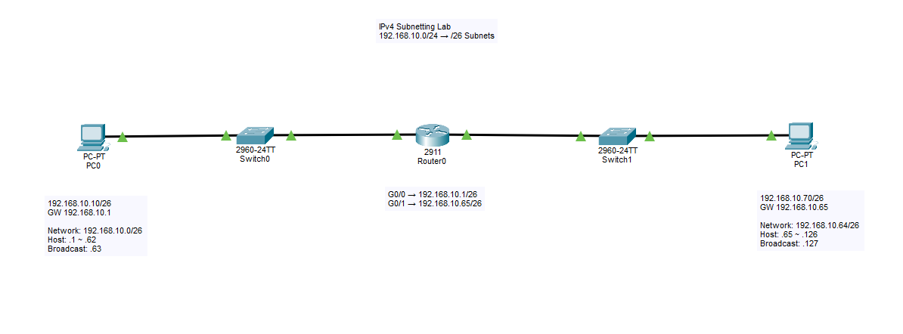

# Lab 05 - IPv4 서브넷팅(Subnetting)

<p align="center">
  
</p>

## 실습 목표

하나의 `192.168.10.0/24` 네트워크를 `/26` 크기의 여러 Subnet으로 나누고,
서로 다른 두 Subnet에 PC를 배치하여 Router를 통한 통신을 구성했습니다.

이번 실습에서는 다음 내용을 직접 확인했습니다.

- CIDR Prefix와 Subnet Mask의 관계
- Block Size 계산
- Network Address 계산
- First / Last Host 계산
- Broadcast Address 계산
- 서로 다른 Subnet 사이의 Routing
- 잘못된 Subnet Mask가 통신에 미치는 영향
- Proxy ARP로 인해 잘못된 설정에서도 Ping이 성공할 수 있는 현상
- `no ip proxy-arp`를 이용한 Proxy ARP 동작 확인

---

## 네트워크 구성도

```text
PC0
192.168.10.10/26
GW 192.168.10.1

Network
192.168.10.0/26
        |
     Switch0
        |
Router0 G0/0
192.168.10.1/26
        |
     Router0
        |
Router0 G0/1
192.168.10.65/26
        |
     Switch1
        |
Network
192.168.10.64/26

PC1
192.168.10.70/26
GW 192.168.10.65
```

---

# Subnetting 기초

IPv4 Address는 총 32bit로 구성됩니다.

예:

```text
192.168.10.0/24
```

`/24`는 앞의 24bit가 Network 부분이라는 의미입니다.

```text
Network                Host
<------ 24bit -------> <8bit>

192 . 168 . 10 . XXXXXXXX
```

Subnet Mask로 표현하면:

```text
/24 = 255.255.255.0
```

Host Bit가 8bit이므로 전체 IPv4 Address 개수는:

```text
2^8 = 256
```

Network Address와 Broadcast Address는 일반 Host에 할당할 수 없으므로 일반적인 `/24`의 사용 가능한 Host 수는:

```text
256 - 2 = 254
```

입니다.

---

# 주요 CIDR 정리

| CIDR | Subnet Mask | 전체 주소 수 | 사용 가능한 Host 수 | Block Size |
|---|---|---:|---:|---:|
| /24 | 255.255.255.0 | 256 | 254 | 256 |
| /25 | 255.255.255.128 | 128 | 126 | 128 |
| /26 | 255.255.255.192 | 64 | 62 | 64 |
| /27 | 255.255.255.224 | 32 | 30 | 32 |
| /28 | 255.255.255.240 | 16 | 14 | 16 |
| /29 | 255.255.255.248 | 8 | 6 | 8 |
| /30 | 255.255.255.252 | 4 | 2 | 4 |

---

# Block Size 계산

이번 실습에서는 `/26`을 사용했습니다.

```text
/26 = 255.255.255.192
```

Block Size는 다음과 같이 계산했습니다.

```text
Block Size = 256 - 192
           = 64
```

따라서 Network Address는 마지막 Octet 기준으로 64씩 증가합니다.

```text
0
64
128
192
```

즉 `192.168.10.0/24`를 `/26`으로 나누면 다음 네 개의 Subnet이 만들어집니다.

```text
192.168.10.0/26
192.168.10.64/26
192.168.10.128/26
192.168.10.192/26
```

---

# /26 Subnet 분석

## Subnet 1

```text
Network Address : 192.168.10.0
First Host      : 192.168.10.1
Last Host       : 192.168.10.62
Broadcast       : 192.168.10.63
```

범위:

```text
192.168.10.0
      ↓
192.168.10.1  ← First Host
      ↓
      ...
      ↓
192.168.10.62 ← Last Host
192.168.10.63 ← Broadcast
```

---

## Subnet 2

```text
Network Address : 192.168.10.64
First Host      : 192.168.10.65
Last Host       : 192.168.10.126
Broadcast       : 192.168.10.127
```

범위:

```text
192.168.10.64  ← Network
192.168.10.65  ← First Host
       ↓
       ...
       ↓
192.168.10.126 ← Last Host
192.168.10.127 ← Broadcast
```

---

# IP 주소 구성

| 장비 | Interface | IP Address | Prefix | Subnet Mask | Default Gateway |
|---|---|---|---|---|---|
| PC0 | FastEthernet0 | 192.168.10.10 | /26 | 255.255.255.192 | 192.168.10.1 |
| Router0 | G0/0 | 192.168.10.1 | /26 | 255.255.255.192 | - |
| Router0 | G0/1 | 192.168.10.65 | /26 | 255.255.255.192 | - |
| PC1 | FastEthernet0 | 192.168.10.70 | /26 | 255.255.255.192 | 192.168.10.65 |

---

# PC0 설정

```text
IP Address      : 192.168.10.10
Subnet Mask     : 255.255.255.192
Default Gateway : 192.168.10.1
```

PC0가 속한 Network:

```text
192.168.10.0/26
```

---

# PC1 설정

```text
IP Address      : 192.168.10.70
Subnet Mask     : 255.255.255.192
Default Gateway : 192.168.10.65
```

PC1이 속한 Network:

```text
192.168.10.64/26
```

PC0과 PC1은 모두 `192.168.10.x` 형태의 주소를 사용하지만,
Subnet Mask가 `/26`이기 때문에 서로 다른 Network에 속합니다.

```text
PC0 192.168.10.10/26
→ 192.168.10.0/26

PC1 192.168.10.70/26
→ 192.168.10.64/26
```

따라서 두 PC 사이의 통신에는 Layer 3 Router가 필요합니다.

---

# Router0 설정

```cisco
enable
configure terminal

no ip domain lookup

interface gigabitethernet 0/0
 ip address 192.168.10.1 255.255.255.192
 no shutdown
exit

interface gigabitethernet 0/1
 ip address 192.168.10.65 255.255.255.192
 no shutdown
exit

end
```

---

# Router Interface 확인

사용 명령어:

```cisco
show ip interface brief
```

정상 상태:

```text
GigabitEthernet0/0   192.168.10.1    up    up
GigabitEthernet0/1   192.168.10.65   up    up
```

---

# Routing Table 확인

사용 명령어:

```cisco
show ip route
```

실제 확인한 주요 결과:

```text
Gateway of last resort is not set

192.168.10.0/24 is variably subnetted, 4 subnets, 2 masks

C    192.168.10.0/26 is directly connected, GigabitEthernet0/0
L    192.168.10.1/32 is directly connected, GigabitEthernet0/0
C    192.168.10.64/26 is directly connected, GigabitEthernet0/1
L    192.168.10.65/32 is directly connected, GigabitEthernet0/1
```

주요 Routing Code:

```text
C = Connected
L = Local
```

---

## Connected Route

```text
C 192.168.10.0/26
C 192.168.10.64/26
```

Router0가 해당 Network에 직접 연결되어 있다는 의미입니다.

따라서 이번 실습에서는 Static Route가 필요하지 않았습니다.

Router0는 이미 다음 두 Network를 직접 알고 있습니다.

```text
192.168.10.0/26  → G0/0
192.168.10.64/26 → G0/1
```

---

## Local Route

```text
L 192.168.10.1/32
L 192.168.10.65/32
```

Router 자신의 Interface IP Address를 나타냅니다.

`/32`는 특정 IPv4 Address 하나를 의미합니다.

---

## Variably Subnetted

Routing Table에서 다음 메시지를 확인했습니다.

```text
192.168.10.0/24 is variably subnetted, 4 subnets, 2 masks
```

현재 Routing Table에는 다음 Route가 존재합니다.

```text
/26
/26
/32
/32
```

따라서:

```text
4 subnets
2 masks
```

로 표시됩니다.

사용되는 Prefix Length는:

```text
/26
/32
```

두 종류입니다.

---

# PC 간 통신 확인

PC0에서 PC1:

```text
ping 192.168.10.70
```

결과:

```text
Success
```

PC1에서 PC0:

```text
ping 192.168.10.10
```

결과:

```text
Success
```

---

# 패킷 전달 과정

PC0에서 PC1으로 패킷을 보낼 때:

```text
PC0
192.168.10.10/26
        |
        | 목적지 192.168.10.70 확인
        |
        | 다른 Subnet으로 판단
        ↓
Default Gateway
192.168.10.1
        |
        ↓
Router0
        |
        | Routing Table Lookup
        |
        | 192.168.10.64/26
        | → G0/1
        ↓
Router0 G0/1
192.168.10.65
        |
        ↓
Switch1
        |
        ↓
PC1
192.168.10.70/26
```

---

# Subnet Mask가 중요한 이유

PC는 목적지 IP Address를 확인한 후 자신의 Subnet Mask를 이용해
목적지가 같은 Network에 있는지 판단합니다.

```text
목적지 IP 확인
       ↓
Subnet Mask 적용
       ↓
같은 Subnet인가?
```

같은 Subnet이라고 판단하면:

```text
목적지의 MAC Address를 ARP로 직접 찾음
```

다른 Subnet이라고 판단하면:

```text
Default Gateway의 MAC Address를 ARP로 찾음
       ↓
Router에게 Packet 전달
```

따라서 Subnet Mask는 단순히 Network 크기를 표시하는 값이 아니라
Host가 패킷을 직접 전달할지 Router에게 보낼지 결정하는 데 사용되는 중요한 정보입니다.

---

# Troubleshooting - 잘못된 Subnet Mask

PC0의 정상 설정:

```text
IP Address  : 192.168.10.10
Subnet Mask : 255.255.255.192
Prefix      : /26
```

Subnet Mask를 일부러 다음과 같이 변경했습니다.

```text
255.255.255.0
```

즉:

```text
192.168.10.10/24
```

로 잘못 설정했습니다.

PC0 입장에서는 목적지:

```text
192.168.10.70
```

을 같은 `192.168.10.0/24` Network에 있다고 판단하게 됩니다.

따라서 Default Gateway로 보내는 대신:

```text
ARP Request
"192.168.10.70의 MAC Address는?"
```

를 자신의 LAN에서 전송하게 됩니다.

PC1은 실제로 Router 반대편에 있으므로
일반적인 Layer 2 ARP Broadcast만으로는 직접 응답할 수 없습니다.

---

# 예상과 다르게 Ping이 성공한 현상

잘못된 `/24` Subnet Mask를 사용했음에도:

```text
ping 192.168.10.70
```

이 성공했습니다.

처음 예상한 결과와 달랐기 때문에 원인을 추가로 확인했습니다.

Router Interface에서 다음 명령어를 사용했습니다.

```cisco
show ip interface gigabitethernet 0/0
```

확인 결과 Proxy ARP가 활성화되어 있었습니다.

```text
Proxy ARP is enabled
```

---

# Proxy ARP

Proxy ARP가 활성화된 Router는
다른 Interface를 통해 목적지 Network로 갈 수 있는 Route를 알고 있는 경우
목적지 Host 대신 자신의 MAC Address로 ARP Reply를 보낼 수 있습니다.

이번 상황:

```text
PC0
192.168.10.10/24
        |
        | ARP Request
        | "192.168.10.70 누구?"
        ↓
Router0
        |
        | Routing Table 확인
        |
        | 192.168.10.64/26 경로 존재
        |
        | Proxy ARP Reply
        ↓
PC0
```

PC0는 Router의 MAC Address를 이용해 Frame을 전송하고,
Router0는 실제 목적지 Network인:

```text
192.168.10.64/26
```

으로 Packet을 Routing할 수 있었습니다.

따라서 PC0의 Subnet Mask가 잘못되어 있음에도 Ping이 성공할 수 있었습니다.

---

# Proxy ARP 비활성화 실험

Proxy ARP 동작을 확인하기 위해 Router0의 PC0 방향 Interface에서 Proxy ARP를 비활성화했습니다.

```cisco
enable
configure terminal

interface gigabitethernet 0/0
 no ip proxy-arp

end
```

PC0의 기존 ARP Cache도 삭제했습니다.

```text
arp -d
```

PC0의 Subnet Mask는 잘못된 `/24` 상태를 유지한 채 다시 테스트했습니다.

```text
ping 192.168.10.70
```

이번에는 통신이 실패했습니다.

PC0는 `192.168.10.70`을 같은 Local Network에 있다고 잘못 판단하여 직접 ARP를 수행했지만,
Router가 Proxy ARP Reply를 하지 않았기 때문입니다.

---

# 정상 Subnet Mask로 복구

PC0의 Subnet Mask를 다시:

```text
255.255.255.192
```

즉 `/26`으로 변경했습니다.

```text
PC0
192.168.10.10/26
```

이제 PC0는:

```text
192.168.10.70
```

이 자신과 다른 Subnet에 있다는 것을 올바르게 판단합니다.

따라서 Packet을 Default Gateway:

```text
192.168.10.1
```

으로 전달하고 정상 통신이 이루어졌습니다.

---

# Proxy ARP 설정 복구

실습 후 Router0의 Proxy ARP 설정도 다시 활성화했습니다.

```cisco
configure terminal

interface gigabitethernet 0/0
 ip proxy-arp

end
```

---

# 이번 Troubleshooting에서 확인한 흐름

```text
정상 /26 환경 구성
        ↓
PC0 ↔ PC1 Ping 성공
        ↓
PC0 Subnet Mask를 /24로 변경
        ↓
예상과 달리 Ping 성공
        ↓
ARP / Router Interface 동작 확인
        ↓
Proxy ARP 활성화 확인
        ↓
no ip proxy-arp 설정
        ↓
ARP Cache 삭제
        ↓
잘못된 /24 상태에서 Ping 실패
        ↓
Subnet Mask를 /26으로 복구
        ↓
Ping 정상 성공
        ↓
Proxy ARP 설정 복구
```

---

# Subnetting 계산 연습

## 예제 1

```text
192.168.1.150/26
```

`/26`:

```text
Subnet Mask = 255.255.255.192
Block Size  = 64
```

Network 시작점:

```text
0
64
128
192
```

`150`은:

```text
128 ≤ 150 < 192
```

이므로:

```text
Network Address : 192.168.1.128
First Host      : 192.168.1.129
Last Host       : 192.168.1.190
Broadcast       : 192.168.1.191
```

---

## 예제 2

```text
192.168.10.77/27
```

`/27`:

```text
Subnet Mask = 255.255.255.224
Block Size  = 32
```

Network 시작점:

```text
0
32
64
96
128
160
192
224
```

`77`은 `64 ~ 95` 범위에 속하므로:

```text
Network Address : 192.168.10.64
First Host      : 192.168.10.65
Last Host       : 192.168.10.94
Broadcast       : 192.168.10.95
```

---

## 예제 3

```text
192.168.50.141/28
```

`/28`:

```text
Subnet Mask = 255.255.255.240
Block Size  = 16
```

`141`은 `128 ~ 143` 범위에 속하므로:

```text
Network Address : 192.168.50.128
First Host      : 192.168.50.129
Last Host       : 192.168.50.142
Broadcast       : 192.168.50.143
```

---

# 빠른 계산 방법

## 1. Prefix를 Subnet Mask로 변환

예:

```text
/26
→ 255.255.255.192
```

## 2. Block Size 계산

```text
256 - 192 = 64
```

## 3. Network 시작점 나열

```text
0
64
128
192
```

## 4. IP가 어느 구간에 있는지 확인

## 5. 해당 구간의 시작 주소가 Network Address

## 6. 다음 Network Address 바로 전 주소가 Broadcast

```text
Broadcast = 다음 Network Address - 1
```

## 7. Host 범위 계산

```text
First Host = Network + 1

Last Host = Broadcast - 1
```

---

# 사용한 주요 명령어

## Router Interface 상태 확인

```cisco
show ip interface brief
```

## Routing Table 확인

```cisco
show ip route
```

## Interface 상세 정보 확인

```cisco
show ip interface gigabitethernet 0/0
```

## Proxy ARP 비활성화

```cisco
interface gigabitethernet 0/0
 no ip proxy-arp
```

## Proxy ARP 활성화

```cisco
interface gigabitethernet 0/0
 ip proxy-arp
```

## Ping

```text
ping <IP Address>
```

## ARP Table 확인

```text
arp -a
```

## ARP Cache 삭제

```text
arp -d
```

---

# 이번 실습에서 배운 점

- IPv4 Address는 IP Address만 보는 것이 아니라 Subnet Mask와 함께 해석해야 한다.
- `/26`의 Subnet Mask는 `255.255.255.192`이다.
- `/26`의 Block Size는 64이다.
- `/26`에서는 일반적으로 하나의 Subnet에 62개의 Host Address를 사용할 수 있다.
- Network Address는 일반 Host에 할당하지 않는다.
- Broadcast Address도 일반 Host에 할당하지 않는다.
- Broadcast Address는 다음 Network Address 바로 전 주소이다.
- 서로 같은 `192.168.10.x` 형태라도 Prefix Length에 따라 서로 다른 Network일 수 있다.
- 서로 다른 Subnet 간 통신에는 Layer 3 Routing이 필요하다.
- Router는 직접 연결된 Network를 Connected Route로 자동 등록한다.
- 직접 연결된 Subnet 사이에서는 별도의 Static Route가 필요하지 않다.
- PC는 Subnet Mask를 이용해 목적지가 Local Network인지 Remote Network인지 판단한다.
- Remote Network라면 Default Gateway를 통해 Packet을 전달한다.
- 잘못된 Subnet Mask는 비정상적인 ARP 동작과 통신 문제를 만들 수 있다.
- Ping 성공만으로 모든 Network 설정이 올바르다고 판단해서는 안 된다.
- Proxy ARP와 같은 기능 때문에 잘못된 Subnet Mask가 일시적으로 가려질 수 있다.
- 예상과 다른 결과가 발생하면 설정을 단정하지 않고 실제 동작 원인을 확인해야 한다.

---

# 실습 파일

```text
05-ipv4-subnetting/
├── README.md
├── topology.png
└── 05-ipv4-subnetting.pkt
```

---

# 실습 완료 항목

- [x] `/24`와 `/26`의 차이 이해
- [x] CIDR Prefix 확인
- [x] Subnet Mask 계산
- [x] Block Size 계산
- [x] Network Address 계산
- [x] First Host 계산
- [x] Last Host 계산
- [x] Broadcast Address 계산
- [x] `/26` Subnet 분할
- [x] 두 개의 `/26` LAN 구성
- [x] Router Interface 설정
- [x] Connected Route 확인
- [x] Local Route 확인
- [x] 서로 다른 Subnet 간 Ping
- [x] 잘못된 Subnet Mask 테스트
- [x] Proxy ARP 확인
- [x] Proxy ARP 비활성화 테스트
- [x] ARP Cache 삭제
- [x] 정상 Subnet Mask 복구
- [x] End-to-End 통신 검증

---

# Lab Status

**완료 (Completed)**