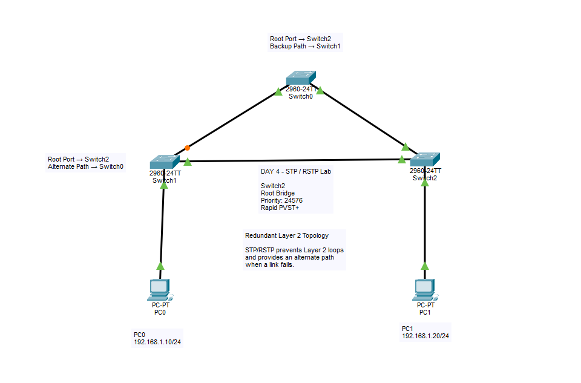

# Lab 06 - STP / RSTP

<p align="center">
  
</p>

## 실습 목표

Cisco Packet Tracer에서 Switch 3대를 이중화된 삼각형 형태로 연결하고,
STP(Spanning Tree Protocol)가 Layer 2 Loop를 방지하는 과정을 직접 확인했습니다.

또한 링크 장애를 발생시켜 Blocking 상태의 대체 경로가 활성화되는 과정을 확인하고,
Bridge Priority를 변경하여 원하는 Switch를 Root Bridge로 직접 지정했습니다.

마지막으로 기존 STP 환경을 Rapid PVST+로 변경하여
RSTP 기반의 빠른 경로 전환도 실습했습니다.

---

# 네트워크 구성

```text
                Switch0
               /       \
              /         \
             /           \
        Switch1 -------- Switch2
           |                |
          PC0              PC1
```

Switch 3대를 삼각형 형태로 연결하여
하나의 링크가 끊어져도 다른 경로를 사용할 수 있는 Redundant Topology를 구성했습니다.

PC 구성:

```text
PC0
192.168.1.10/24

PC1
192.168.1.20/24
```

두 PC는 같은 `192.168.1.0/24` Network에 있으므로
Default Gateway 없이 Layer 2 Switching만으로 통신할 수 있습니다.

---

# STP가 필요한 이유

Switch 간에 여러 개의 경로가 존재하면 장애 발생 시 다른 경로를 사용할 수 있어
Network Redundancy 측면에서는 유리합니다.

하지만 Layer 2 Network에서 모든 경로가 동시에 Forwarding 상태가 되면
Ethernet Frame이 Switch 사이를 계속 순환하는 Layer 2 Loop가 발생할 수 있습니다.

특히 Broadcast Frame은 여러 Switch를 통해 반복적으로 복제될 수 있으며,
심한 경우 Broadcast Storm으로 이어질 수 있습니다.

```text
        Switch0
       /       \
      /         \
 Switch1 ------ Switch2
```

STP는 중복 경로 중 일부를 논리적으로 차단하여:

```text
        Switch0
       /       \
      /         \
 Switch1 --X--- Switch2
```

Loop가 없는 논리적 Topology를 만듭니다.

정상 경로에 장애가 발생하면 기존에 차단해 둔 경로를 활성화하여
통신을 계속할 수 있도록 합니다.

---

# STP 주요 개념

## Root Bridge

STP에서 모든 경로 계산의 기준이 되는 Switch입니다.

Switch들은 Bridge ID를 비교하여 Root Bridge를 선정합니다.

```text
Bridge ID
= Bridge Priority + MAC Address
```

더 낮은 Bridge ID를 가진 Switch가 Root Bridge가 됩니다.

Priority가 같으면 MAC Address가 더 낮은 Switch가 Root Bridge가 됩니다.

---

## Root Port

Root Bridge가 아닌 각 Switch에서
Root Bridge까지 가는 가장 좋은 경로의 Port입니다.

```text
Non-Root Switch
       |
       | Root Port
       ↓
Root Bridge
```

각 Non-Root Switch에는 일반적으로 하나의 Root Port가 선정됩니다.

Root Bridge 자신에게는 Root Port가 없습니다.

---

## Designated Port

각 Network Segment에서 Frame을 Forwarding하도록 선택된 Port입니다.

Root Bridge의 활성 Port는 일반적으로 Designated Port가 됩니다.

```text
Desg FWD
```

는:

```text
Designated Port
+
Forwarding State
```

를 의미합니다.

---

## Alternate Port

현재 주 경로가 아닌 대체 경로입니다.

RSTP에서는 Alternate Port라는 역할이 명확하게 사용됩니다.

기존 경로에 장애가 발생하면 Alternate Port가 새로운 Forwarding 경로로
빠르게 전환될 수 있습니다.

---

# Port State / Role 확인

STP 상태 확인 명령어:

```cisco
show spanning-tree vlan 1
```

주요 표시:

```text
Root = Root Port
Desg = Designated Port
Altn = Alternate Port

FWD = Forwarding
BLK = Blocking
```

---

# 최초 Root Bridge 확인

Switch0에서:

```cisco
show spanning-tree vlan 1
```

를 실행했습니다.

확인 결과:

```text
Root ID    Priority    32769
Address     0007.ECA4.498E

This bridge is the root
```

따라서 최초 Root Bridge는:

```text
Switch0
MAC Address = 0007.ECA4.498E
```

였습니다.

---

# Priority가 32769로 표시되는 이유

기본 Bridge Priority:

```text
32768
```

VLAN 1의 System ID Extension:

```text
+ 1
```

따라서 출력에서는:

```text
32769
```

로 표시되었습니다.

```text
32768 + VLAN 1
= 32769
```

출력:

```text
Bridge ID Priority 32769
(priority 32768 sys-id-ext 1)
```

---

# Root Bridge의 Port 상태

Switch0:

```text
Interface        Role Sts Cost

Gi0/1            Desg FWD 4
Gi0/2            Desg FWD 4
```

Switch0가 Root Bridge이기 때문에
두 GigabitEthernet Port 모두 Designated Forwarding 상태였습니다.

---

# Switch1의 STP 상태

Switch1에서:

```cisco
show spanning-tree vlan 1
```

확인 결과:

```text
Root ID
Priority    32769
Address     0007.ECA4.498E
Cost        4
Port        25(GigabitEthernet0/1)
```

Port 역할:

```text
Fa0/1   Desg FWD 19
Gi0/1   Root FWD 4
Gi0/2   Altn BLK 4
```

Switch1은 Root Bridge인 Switch0와 직접 연결된:

```text
Gi0/1
```

을 Root Port로 선택했습니다.

```text
Gi0/1
Root FWD
```

반면 Switch1과 Switch2 사이의 중복 경로:

```text
Gi0/2
```

는:

```text
Altn BLK
```

상태로 차단되어 있었습니다.

---

# STP Path Cost

이번 실습에서 확인한 주요 Cost:

```text
FastEthernet
100 Mbps
Cost = 19

GigabitEthernet
1 Gbps
Cost = 4
```

STP는 Root Bridge까지의 Root Path Cost를 비교하여
더 낮은 Cost를 가지는 경로를 선호합니다.

예:

```text
Switch1 → Switch0

Cost = 4
```

다른 경로:

```text
Switch1 → Switch2 → Switch0

4 + 4 = 8
```

따라서 Cost 4인 직접 경로가 Root Port로 선택되었습니다.

---

# 장애 실험 1 - Root Port Link Failure

Switch1과 Root Bridge인 Switch0 사이의 직접 연결을 제거했습니다.

기존:

```text
Switch1 → Switch0

Gi0/1
Root FWD

Root Path Cost = 4
```

링크 장애 발생:

```text
Switch1 --X-- Switch0
```

STP가 새로운 경로를 계산했습니다.

```text
Switch1
    |
    |
 Switch2
    |
    |
 Switch0
   ROOT
```

Switch1에서 다시:

```cisco
show spanning-tree vlan 1
```

확인 결과:

```text
Root ID
Cost 8
Port 26(GigabitEthernet0/2)
```

Port 상태:

```text
Gi0/2   Root FWD 4
```

기존:

```text
Gi0/2
Altn BLK
```

였던 Port가:

```text
Gi0/2
Root FWD
```

로 변경되었습니다.

---

# 장애 발생 후 Path Cost

새로운 경로:

```text
Switch1 → Switch2 → Switch0
```

각 GigabitEthernet 링크의 Cost:

```text
4
```

따라서 총 Root Path Cost:

```text
4 + 4 = 8
```

출력에서도:

```text
Cost 8
```

을 확인했습니다.

이를 통해 STP가 기존 경로의 장애를 감지하고
대체 경로를 활성화하는 것을 확인했습니다.

---

# Root Bridge 직접 지정

기본 설정에서는 모든 Switch의 Priority가 동일하기 때문에
MAC Address까지 비교하여 Root Bridge가 결정될 수 있습니다.

Network 관리자가 원하는 Switch를 Root Bridge로 사용하기 위해
Switch2의 Bridge Priority를 낮췄습니다.

Switch2:

```cisco
enable
configure terminal

spanning-tree vlan 1 priority 24576

end
```

---

# 새로운 Root Bridge 확인

Switch2:

```cisco
show spanning-tree vlan 1
```

결과:

```text
Root ID    Priority    24577
Address     0009.7CBB.AB75

This bridge is the root
```

따라서:

```text
Switch2 = Root Bridge
```

가 되었습니다.

설정한 Priority:

```text
24576
```

VLAN 1 System ID Extension:

```text
+1
```

따라서 실제 출력:

```text
24577
```

로 표시되었습니다.

---

# Root Bridge 변경 후 STP 재계산

Switch2가 새로운 Root Bridge가 되면서
Switch0과 Switch1의 Port Role도 다시 계산되었습니다.

---

## Switch0

```text
Root ID
Priority = 24577
Address  = 0009.7CBB.AB75
Cost     = 4
Port     = Gi0/2
```

Port:

```text
Gi0/1   Desg FWD
Gi0/2   Root FWD
```

Switch0의 새로운 Root Port:

```text
Gi0/2
```

즉:

```text
Switch0 → Switch2
```

직접 경로를 이용합니다.

---

## Switch1

```text
Root ID
Priority = 24577
Address  = 0009.7CBB.AB75
Cost     = 4
Port     = Gi0/2
```

Port:

```text
Fa0/1   Desg FWD
Gi0/1   Altn BLK
Gi0/2   Root FWD
```

Switch1의 Root Port:

```text
Gi0/2
```

입니다.

Switch0 ↔ Switch1 Link에서는 Switch0 쪽이:

```text
Desg FWD
```

Switch1 쪽이:

```text
Altn BLK
```

상태가 되었습니다.

---

# 같은 Root Path Cost일 때의 선택

Switch0과 Switch1 모두 Root Bridge인 Switch2까지의 Cost가:

```text
4
```

로 동일했습니다.

이 경우 STP는 추가 Tie-break 기준을 사용합니다.

두 Switch의 기본 Priority 역시 동일했으므로
Bridge ID의 MAC Address 부분까지 비교되었습니다.

Switch0:

```text
0007.ECA4.498E
```

Switch1:

```text
0040.0B8A.12EB
```

Switch0의 Bridge ID가 더 낮았기 때문에
Switch0 쪽 Port가 해당 Segment의 Designated Port로 선정되었습니다.

---

# STP 동작 순서

이번 실습을 통해 STP의 기본적인 판단 과정을 다음과 같이 이해했습니다.

```text
1. Root Bridge 선정
        ↓
2. 각 Non-Root Switch의 Root Port 선정
        ↓
3. 각 Network Segment의 Designated Port 선정
        ↓
4. 남은 중복 경로 차단
```

경로 선택에서는 우선적으로 낮은 Root Path Cost를 선호하며,
Cost가 같으면 Bridge ID 등의 Tie-break 기준이 사용됩니다.

---

# STP에서 RSTP로 변경

기존 STP보다 더 빠른 Network Convergence를 위해
Cisco Rapid PVST+를 적용했습니다.

Switch0, Switch1, Switch2 모두:

```cisco
enable
configure terminal

spanning-tree mode rapid-pvst

end
```

설정했습니다.

---

# Rapid PVST+ 확인

Switch2:

```cisco
show spanning-tree vlan 1
```

결과:

```text
Spanning tree enabled protocol rstp
```

기존:

```text
protocol ieee
```

에서:

```text
protocol rstp
```

로 변경된 것을 확인했습니다.

Switch2는 기존 Priority 설정을 유지하여
계속 Root Bridge로 동작했습니다.

```text
This bridge is the root
```

---

# STP와 RSTP

기존 STP의 대표적인 Port State:

```text
Blocking
Listening
Learning
Forwarding
Disabled
```

RSTP에서는 크게:

```text
Discarding
Learning
Forwarding
```

으로 단순화됩니다.

RSTP는 중복 경로와 인접 Switch 정보를 활용하여
Topology 변화 시 기존 STP보다 빠르게 새로운 Forwarding 상태로
전환할 수 있도록 개선되었습니다.

---

# RSTP 주요 Port Role

RSTP에서는 다음 Port Role이 사용됩니다.

```text
Root Port
Designated Port
Alternate Port
Backup Port
```

이번 실습에서는 특히:

```text
Root Port
Designated Port
Alternate Port
```

를 직접 확인했습니다.

Alternate Port는 Root Bridge로 향하는 대체 경로 역할을 하며
주 경로에 장애가 발생하면 빠르게 활성 경로로 사용될 수 있습니다.

---

# RSTP 장애 실험

PC 설정:

```text
PC0
192.168.1.10/24

PC1
192.168.1.20/24
```

같은 Network이므로 Default Gateway는 설정하지 않았습니다.

PC0에서:

```text
ping 192.168.1.20
```

을 수행하여 정상 통신을 확인했습니다.

---

# Interface Shutdown으로 장애 생성

Switch0에서 Root Bridge인 Switch2로 직접 연결된:

```text
Gi0/2
```

를 수동으로 비활성화했습니다.

```cisco
enable
configure terminal

interface gigabitethernet 0/2
 shutdown

end
```

기존 Root 경로:

```text
Switch0 → Switch2

Root Path Cost = 4
```

가 사라졌습니다.

---

# RSTP 경로 재계산

Switch0:

```cisco
show spanning-tree vlan 1
```

확인 결과:

```text
Root ID
Priority = 24577
Address  = 0009.7CBB.AB75
Cost     = 8
Port     = 25(GigabitEthernet0/1)
```

Port:

```text
Gi0/1   Root FWD 4
```

즉 새로운 경로:

```text
Switch0
   |
   | Gi0/1
   ↓
Switch1
   |
   ↓
Switch2
  ROOT
```

가 사용되었습니다.

전체 Root Path Cost:

```text
4 + 4 = 8
```

으로 변경되었습니다.

---

# Interface Cost와 Root Path Cost 차이

출력:

```text
Root ID
Cost 8
```

은 현재 Switch에서 Root Bridge까지의:

```text
전체 Root Path Cost
```

를 의미합니다.

반면:

```text
Gi0/1 Root FWD Cost 4
```

의 Cost 4는:

```text
해당 Interface의 개별 STP Cost
```

입니다.

따라서:

```text
Interface Cost = 4

전체 Root Path Cost
= 4 + 4
= 8
```

로 해석할 수 있습니다.

---

# 장애 상황에서도 통신 확인

RSTP가 새로운 경로를 선택한 후:

```text
PC0 → PC1
```

Ping을 수행했습니다.

```text
ping 192.168.1.20
```

대체 경로를 통해 통신이 가능한 것을 확인했습니다.

---

# Interface 복구

장애 테스트 후 Switch0의 Gi0/2를 다시 활성화했습니다.

```cisco
enable
configure terminal

interface gigabitethernet 0/2
 no shutdown

end
```

RSTP가 다시 Topology를 계산하여
Root Bridge와 직접 연결된 Cost 4의 경로를 사용할 수 있게 되었습니다.

---

# 최종 Network 상태

```text
                 Switch2
                ROOT BRIDGE
              Priority 24576
                 RSTP
               /       \
              /         \
        Switch0 ------- Switch1
                            |
                          Altn
```

모든 물리 Link는 정상 상태로 복구했습니다.

STP Mode:

```text
Rapid PVST+
```

Root Bridge:

```text
Switch2
```

Bridge Priority:

```text
24576
```

PC 통신:

```text
PC0 192.168.1.10
        ↕
PC1 192.168.1.20

Ping Success
```

---

# 사용한 주요 Cisco IOS 명령어

## STP 상태 확인

```cisco
show spanning-tree vlan 1
```

---

## STP 전체 Summary

```cisco
show spanning-tree summary
```

---

## Root Bridge Priority 설정

```cisco
configure terminal

spanning-tree vlan 1 priority 24576

end
```

---

## Rapid PVST+ 설정

```cisco
configure terminal

spanning-tree mode rapid-pvst

end
```

---

## Interface 비활성화

```cisco
configure terminal

interface gigabitethernet 0/2
 shutdown

end
```

---

## Interface 활성화

```cisco
configure terminal

interface gigabitethernet 0/2
 no shutdown

end
```

---

## Interface 상태 확인

```cisco
show interfaces status
```

---

## 통신 확인

```text
ping <IP Address>
```

---

# Troubleshooting / Verification 흐름

```text
Switch 3대 Redundant Topology 구성
        ↓
기본 STP 동작 확인
        ↓
Switch0 Root Bridge 확인
        ↓
Root / Designated / Alternate Port 분석
        ↓
Alternate Port Blocking 확인
        ↓
Root Port Link 장애 발생
        ↓
Alternate 경로가 Root Port로 전환
        ↓
Root Path Cost 4 → 8 확인
        ↓
Switch2 Priority 24576 설정
        ↓
Switch2를 Root Bridge로 변경
        ↓
전체 STP Port Role 재계산 확인
        ↓
Rapid PVST+ 적용
        ↓
protocol rstp 확인
        ↓
Switch0 Gi0/2 Shutdown
        ↓
RSTP 대체 경로 활성화
        ↓
Switch0 Root Path Cost 4 → 8
        ↓
PC0 ↔ PC1 Ping 성공
        ↓
Gi0/2 No Shutdown
        ↓
정상 Topology 복구
```

---

# 이번 실습에서 배운 점

- Ethernet Switch Network에 중복 경로가 존재하면 Layer 2 Loop가 발생할 수 있다.
- Broadcast Frame이 Loop를 돌면 Broadcast Storm이 발생할 수 있다.
- STP는 중복 경로 중 일부를 차단하여 Loop-Free Topology를 만든다.
- STP는 하나의 Root Bridge를 기준으로 전체 Tree를 구성한다.
- 낮은 Bridge ID를 가진 Switch가 Root Bridge가 된다.
- Bridge Priority가 같으면 MAC Address가 Root Bridge 선정에 사용될 수 있다.
- Network 관리자가 Priority를 직접 설정하여 원하는 Switch를 Root Bridge로 만들 수 있다.
- Root Bridge에는 Root Port가 없다.
- 각 Non-Root Switch는 Root까지 가장 좋은 Port를 Root Port로 선택한다.
- Designated Port는 해당 Segment에서 Forwarding을 담당한다.
- Alternate Port는 중복 경로에서 대체 경로 역할을 한다.
- STP Path Cost가 낮은 경로가 우선된다.
- GigabitEthernet의 Cost 4와 FastEthernet의 Cost 19를 직접 확인했다.
- Link 장애가 발생하면 STP가 새로운 경로를 계산한다.
- 기존 Alternate / Blocking Port가 새로운 Root Port가 될 수 있다.
- Root Bridge를 변경하면 전체 STP Port Role이 다시 계산된다.
- Rapid PVST+는 RSTP를 VLAN별로 사용하는 Cisco 방식이다.
- `show spanning-tree vlan 1`을 통해 Root Bridge와 Port Role을 확인할 수 있다.
- Interface의 개별 Cost와 Root Bridge까지의 전체 Root Path Cost는 서로 다른 값이다.
- 물리적 케이블을 제거하지 않고 `shutdown` 명령어를 이용해 장애를 만들 수 있다.
- `no shutdown`을 이용해 Interface를 다시 복구할 수 있다.
- STP/RSTP는 Loop 방지뿐만 아니라 Redundant Network에서 장애 발생 시 대체 경로를 제공한다.

---

# 핵심 개념 요약

```text
Root Bridge
→ STP의 기준 Switch

Root Port
→ Non-Root Switch가 Root로 가는 최적 Port

Designated Port
→ 해당 Segment에서 Forwarding하는 Port

Alternate Port
→ 주 경로 장애에 대비한 대체 Port

Forwarding
→ 일반 Frame 전달 가능

Blocking / Discarding
→ 일반 Frame 전달 차단
```

STP를 한 문장으로 정리하면:

```text
중복 경로 중 일부를 차단하여
Layer 2 Loop를 방지하고,
기존 경로 장애 시 대체 경로를 사용할 수 있게 하는 Protocol
```

RSTP를 한 문장으로 정리하면:

```text
STP의 기본 목적을 유지하면서
Topology 변화 시 더 빠른 수렴을 제공하도록 개선된 Protocol
```

---

# 실습 파일

```text
06-stp-rstp/
├── README.md
├── topology.png
└── 06-stp-rstp.pkt
```

---

# 실습 완료 항목

- [x] Switch 3대 Redundant Topology 구성
- [x] Layer 2 Loop 개념 이해
- [x] Broadcast Storm 개념 이해
- [x] STP 동작 확인
- [x] Root Bridge 확인
- [x] Bridge ID 확인
- [x] Bridge Priority 확인
- [x] Root Port 확인
- [x] Designated Port 확인
- [x] Alternate Port 확인
- [x] Blocking 상태 확인
- [x] STP Path Cost 확인
- [x] Root Port Link 장애 발생
- [x] 대체 경로 활성화 확인
- [x] Root Path Cost 변화 확인
- [x] Root Bridge Priority 직접 설정
- [x] Switch2 Root Bridge 지정
- [x] Root 변경 후 Port Role 재계산 확인
- [x] Rapid PVST+ 설정
- [x] RSTP 동작 확인
- [x] Interface Shutdown 장애 실험
- [x] RSTP 대체 경로 전환 확인
- [x] PC0 ↔ PC1 Ping 검증
- [x] Interface 복구
- [x] 최종 End-to-End 통신 확인

---

# Lab Status

**완료 (Completed)**